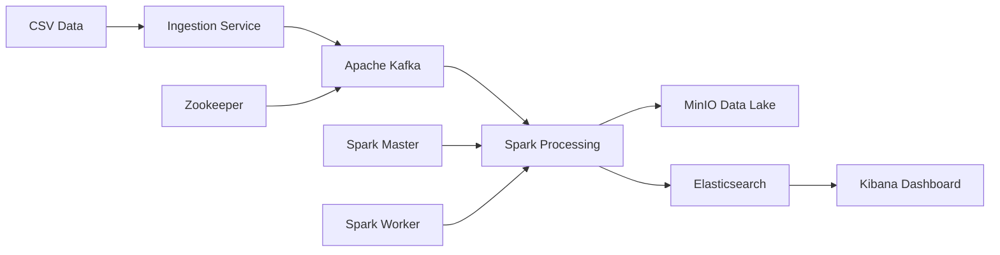

# 🚀 Batch Processing Data Pipeline

# 🚀 Data Pipeline Project - Production-Ready E-commerce Analytics

## 📋 **Overview**
A scalable, real-time data pipeline that processes e-commerce events and generates customer insights. Built with Apache Kafka, Spark, Elasticsearch, and containerized with Docker for easy deployment.

**Capabilities:**
- 📊 Process millions of e-commerce events (views, purchases, cart additions)
- 👥 Generate detailed customer profiles and behavioral segments  
- 💰 Track revenue, conversion rates, and business metrics
- 📈 Provide real-time analytics dashboards and business intelligence
- 🔍 Deliver actionable recommendations for business growth

**Architecture:** Kafka → Spark → MinIO (Data Lake) + Elasticsearch → Kibana

---

## 🖥️ **System Requirements**

### **Windows Users (WSL2)**
- Windows 10 version 2004+ or Windows 11
- WSL2 enabled with Ubuntu 22.04
- Docker Desktop for Windows installed and running
- At least 8GB RAM (16GB recommended)
- 20GB free disk space

### **Linux Users (Ubuntu 22.04)**
- Ubuntu 22.04 LTS or compatible distribution
- At least 8GB RAM (16GB recommended)  
- 20GB free disk space
- Internet connection for package downloads

---

## 🛠️ **Installation Guide**

### **Step 1: Prepare Your Environment**

#### **For Windows Users:**

1. **Install WSL2 with Ubuntu 22.04:**
   ```powershell
   # Open PowerShell as Administrator
   wsl --install -d Ubuntu-22.04
   ```

2. **Install Docker Desktop for Windows:**
   - Download from https://www.docker.com/products/docker-desktop
   - Install and restart Windows
   - Open Docker Desktop and go to Settings → Resources → WSL Integration
   - Enable integration with Ubuntu-22.04

3. **Verify Docker Desktop Integration:**
   ```bash
   # Open Ubuntu terminal and test
   docker --version
   docker compose version
   docker info
   ```

#### **For Linux Users:**

1. **Update System:**
   ```bash
   sudo apt update && sudo apt upgrade -y
   ```

2. **Install Docker:**
   ```bash
   # Install Docker
   curl -fsSL https://get.docker.com -o get-docker.sh
   sudo sh get-docker.sh
   
   # Add user to docker group
   sudo usermod -aG docker $USER
   
   # Install Docker Compose
   sudo apt install docker-compose-plugin -y
   
   # Logout and login again, then verify
   docker --version && docker compose version
   ```

### **Step 2: Configure System Settings**

1. **Set Elasticsearch Memory Limits:**
   ```bash
   # Required for Elasticsearch to start properly
   echo "vm.max_map_count=262144" | sudo tee -a /etc/sysctl.conf
   sudo sysctl -p
   ```

2. **Increase File Descriptor Limits:**
   ```bash
   # Optional: Improves performance under high load
   echo "*               soft    nofile          65536" | sudo tee -a /etc/security/limits.conf
   echo "*               hard    nofile          65536" | sudo tee -a /etc/security/limits.conf
   ```

### **Step 3: Install Python Dependencies**

1. **Install Python and Essential Tools:**
   ```bash
   sudo apt install python3 python3-pip python3-venv git curl -y
   ```

2. **Create Python Virtual Environment:**
   ```bash
   # Create and activate virtual environment
   python3 -m venv ~/venv-datapipeline
   source ~/venv-datapipeline/bin/activate
   
   # Upgrade pip
   pip install --upgrade pip
   ```

### **Step 4: Download and Setup Project**

1. **Clone the Repository:**
   ```bash
   # Clone project
   git clone https://github.com/ecrent/data_pipeline_project.git
   cd data_pipeline_project
   ```

2. **Install Python Dependencies:**
   ```bash
   # Make sure virtual environment is activated
   source ~/venv-datapipeline/bin/activate
   
   # Install all required packages
   pip install kafka-python==2.2.15 elasticsearch==8.19.0 pandas==2.3.1 numpy==2.3.1 matplotlib==3.10.3 seaborn==0.13.2 requests==2.32.4 pyarrow==16.1.0 minio==7.2.7
   ```

3. **Configure Environment:**
   ```bash
   # Set environment to local for WSL/Linux
   sed -i 's/ENVIRONMENT=codespaces/ENVIRONMENT=local/' .env
   
   # Verify configuration
   grep "ENVIRONMENT=" .env
   ```

### **Step 5: Start the Data Pipeline**

1. **Start All Services:**
   ```bash
   # Pull and start all containers
   docker compose pull
   docker compose up -d
   ```

2. **Wait for Services to Initialize:**
   ```bash
   # Wait for services to start (about 2-3 minutes)
   echo "Waiting for services to initialize..."
   sleep 120
   
   # Check service status
   docker compose ps
   ```

### **Step 6: Verify Installation**

1. **Check Service Health:**
   ```bash
   # Activate Python environment if not already active
   source ~/venv-datapipeline/bin/activate
   
   # Run health check
   python monitoring/pipeline_monitor.py
   # Select option 1 for single health check
   ```

2. **Test Basic Connectivity:**
   ```bash
   # Test individual services
   curl -s http://localhost:9200/_cluster/health | grep -o '"status":"[^"]*"'
   curl -s http://localhost:9000/minio/health/live && echo "MinIO: OK"
   docker compose exec kafka kafka-topics.sh --list --bootstrap-server localhost:9092
   ```

3. **Access Web Interfaces:**
   Open these URLs in your browser:
   - **Spark Master UI:** http://localhost:8080
   - **Spark Worker UI:** http://localhost:8081  
   - **Kibana Dashboard:** http://localhost:5601
   - **MinIO Console:** http://localhost:9001 (login: `minioadmin` / `minioadmin123`)

---

## 🎯 **Quick Start Usage**

### **Process Sample Data:**

1. **Run End-to-End Processing:**
   ```bash
   # Make sure you're in the project directory and venv is active
   cd ~/data_pipeline_project
   source ~/venv-datapipeline/bin/activate
   
   # Process the sample dataset (885K+ events)
   python processing/run_complete_pipeline.py
   ```

2. **View Business Analytics:**
   ```bash
   # Generate comprehensive business report
   python analytics/advanced_analytics.py
   ```

3. **Monitor System Health:**
   ```bash
   # Real-time monitoring (updates every 30 seconds)
   python monitoring/pipeline_monitor.py
   # Select option 2
   ```

### **Process Your Own Data:**

1. **Prepare Your CSV File:**
   Your CSV should have these columns:
   ```
   user_id,event_type,product_id,price,timestamp
   12345,view,67890,29.99,2024-01-15 10:30:00
   12345,cart,67890,29.99,2024-01-15 10:32:00
   12345,purchase,67890,29.99,2024-01-15 10:35:00
   ```

2. **Replace Sample Data:**
   ```bash
   # Backup original sample data
   mv data/events.csv data/events_sample.csv
   
   # Copy your data file
   cp /path/to/your/events.csv data/events.csv
   
   # Verify format
   head -5 data/events.csv
   ```

3. **Process Your Data:**
   ```bash
   # Stream your data to Kafka
   python ingestion/src/kafka_producer.py
   
   # Process and analyze
   python processing/run_complete_pipeline.py
   
   # Generate analytics
   python analytics/advanced_analytics.py
   ```

---

## 📊 **Daily Operations**

### **Service Management:**
```bash
# Start services
docker compose up -d

# Stop services
docker compose down

# Restart specific service
docker compose restart elasticsearch

# View logs
docker compose logs -f kafka
```

### **Data Processing:**
```bash
# Always activate environment first
source ~/venv-datapipeline/bin/activate

# Process specific number of events
python processing/run_complete_pipeline.py --max-events 10000

# Monitor processing performance
python monitoring/pipeline_monitor.py
```

### **Scale Processing:**
```bash
# Add more Spark workers for increased throughput
docker compose up -d --scale spark-worker=3

# Verify workers are connected
curl -s http://localhost:8080 | grep -o "Workers ([0-9]*)"
```

---

## 🆘 **Troubleshooting**

### **Docker Issues:**

**Problem:** `docker: command not found`
```bash
# For WSL: Ensure Docker Desktop is running on Windows
# For Linux: Reinstall Docker
curl -fsSL https://get.docker.com -o get-docker.sh && sudo sh get-docker.sh
```

**Problem:** `permission denied while trying to connect to Docker`
```bash
# Add user to docker group
sudo usermod -aG docker $USER
# Logout and login again
```

**Problem:** Containers fail to start
```bash
# Check system resources
free -h && df -h

# Clean up unused containers and images
docker system prune -f

# Restart Docker Desktop (WSL) or Docker daemon (Linux)
```

### **Service Issues:**

**Problem:** Elasticsearch won't start
```bash
# Increase memory map limit
echo "vm.max_map_count=262144" | sudo tee -a /etc/sysctl.conf
sudo sysctl -p

# Restart Elasticsearch
docker compose restart elasticsearch
```

**Problem:** Kafka connection errors
```bash
# Check if Kafka is running
docker compose ps kafka

# Recreate Kafka container
docker compose stop kafka && docker compose rm -f kafka && docker compose up -d kafka
```

**Problem:** Python import errors
```bash
# Reinstall dependencies in virtual environment
source ~/venv-datapipeline/bin/activate
pip install --force-reinstall -r requirements.txt
```

### **Performance Issues:**

**Problem:** Slow processing
```bash
# Check resource usage
docker stats

# Scale up workers
docker compose up -d --scale spark-worker=3

# Reduce batch size in processing scripts
```

**Problem:** Out of memory errors
```bash
# Check memory usage
free -h

# Reduce Elasticsearch heap size in docker-compose.yml
# Change ES_JAVA_OPTS=-Xms2g -Xmx2g to ES_JAVA_OPTS=-Xms1g -Xmx1g
```

---

## 📈 **Performance Metrics**

### **Expected Performance:**
- **Processing Speed:** 1,000+ events/second
- **Memory Usage:** ~6GB RAM for all services
- **Storage Growth:** ~100MB per 100K events processed
- **Startup Time:** 2-3 minutes for all services

### **Monitoring Commands:**
```bash
# System resources
docker stats --no-stream

# Processing metrics
curl -s http://localhost:9200/customer_profiles/_stats | grep '"count"'

# Service health
python monitoring/pipeline_monitor.py
```

---

## 🏗️ **Architecture Overview**

```
📊 Data Flow:
[CSV Files] → [Kafka Ingestion] → [Spark Processing] → [Dual Storage]
                                                          ↓
[MinIO Data Lake (Parquet)] ← → [Elasticsearch (Search)] → [Kibana Dashboards]
```

### **Components:**
- **🌊 Apache Kafka:** High-throughput event streaming (3 partitions)
- **⚡ Apache Spark:** Distributed data processing cluster
- **🗄️ MinIO:** S3-compatible data lake for historical data
- **🔍 Elasticsearch:** Real-time search and analytics engine
- **📈 Kibana:** Data visualization and dashboard platform
- **🐳 Docker:** Containerized deployment and orchestration

### **Data Storage:**
- **Raw Events:** Parquet files in MinIO (efficient compression)
- **Customer Profiles:** Elasticsearch index (fast queries)  
- **Analytics:** Pre-computed metrics and insights
- **Logs:** Service logs accessible via Docker

---

## 🎓 **Next Steps**

### **For Business Users:**
1. **Explore Dashboards:** Visit http://localhost:5601 for Kibana analytics
2. **Generate Reports:** Use `python analytics/advanced_analytics.py` 
3. **Monitor Metrics:** Track customer conversion and revenue trends

### **For Developers:**
1. **Customize Processing:** Edit `processing/src/data_processor.py`
2. **Add Analytics:** Extend `analytics/advanced_analytics.py`
3. **Scale Infrastructure:** Add workers and tune performance

### **For Data Scientists:**
1. **Query Data:** Direct Elasticsearch queries for custom analysis
2. **Access Raw Data:** Parquet files in MinIO for ML model training
3. **Extend Pipeline:** Add ML-based customer segmentation

---

## 📚 **Additional Documentation**

- `QUICK_START.md` - Command reference and daily operations
- `ARCHITECTURE_OVERVIEW.md` - Technical deep dive and design decisions
- `DEPLOYMENT_GUIDE.md` - Infrastructure as Code and scaling
- `SYSTEM_STATUS.md` - Current system health and performance

---

## ✅ **Success Checklist**

Your pipeline is working correctly when:

- [ ] All containers show "Up" status: `docker compose ps`
- [ ] Health monitor shows all services "Healthy": `python monitoring/pipeline_monitor.py`
- [ ] Spark UI shows connected workers: http://localhost:8080
- [ ] Data processing completes successfully: `python processing/run_complete_pipeline.py`
- [ ] Analytics generate business insights: `python analytics/advanced_analytics.py`
- [ ] Web dashboards are accessible: http://localhost:5601, http://localhost:9001

**🎊 Congratulations! You now have a production-ready data pipeline capable of processing millions of events and generating actionable business intelligence.**

---

## 🤝 **Support**

**Common Commands Reference:**
```bash
# Daily workflow
cd ~/data_pipeline_project && source ~/venv-datapipeline/bin/activate
python monitoring/pipeline_monitor.py  # Check health
python processing/run_complete_pipeline.py  # Process data
python analytics/advanced_analytics.py  # View insights

# Service management
docker compose up -d    # Start all services
docker compose down     # Stop all services
docker compose logs -f  # View logs
```

**Log Locations:**
- Service logs: `docker compose logs [service-name]`
- Application logs: `processing/logs/` directory
- System health: `python monitoring/pipeline_monitor.py`

*💡 Pro Tip: Always activate your Python virtual environment (`source ~/venv-datapipeline/bin/activate`) before running pipeline commands.*

## 🏗️ Architecture Overview

This project implements a modern data engineering pipeline using a microservices architecture with the following components:



### Core Components

- **🔄 Apache Kafka**: Message streaming platform for reliable data ingestion
- **⚡ Apache Spark**: Distributed processing engine for data transformation and aggregation
- **🗄️ MinIO**: S3-compatible object storage for data lake functionality  
- **🔍 Elasticsearch**: Analytics database for storing processed customer profiles
- **📊 Kibana**: Visualization platform for exploring customer data
- **🐍 Python Services**: Custom ingestion and processing applications

## 🌍 Multi-Environment Support

This pipeline works seamlessly in both **GitHub Codespaces** and **local WSL** environments:

### GitHub Codespaces
- Automatic environment detection
- Dynamic URL generation (e.g., `https://super-duper-waffle-pvqvvr74jxg3rx-5601.app.github.dev/`)
- Port visibility configuration
- HTTPS endpoints with proper forwarding

### Local Development (WSL)
- Standard localhost URLs (e.g., `http://localhost:5601/`)
- Direct container networking
- Optimized for local development

## 🚀 Quick Start

### 1. Environment Setup
```bash
# Detect environment and generate service URLs
./setup-environment.sh

# Configure port visibility (Codespaces only)
./configure-ports.sh
```

### 2. Dataset Setup
```bash
# Download the dataset manually from Kaggle:
# 1. Visit: https://www.kaggle.com/mkechinov/ecommerce-events-history-in-electronics-store
# 2. Download the main CSV file
# 3. Save it as ./data/electronics.csv

# Verify dataset is ready
make check-data
```

### 3. Start Core Services
```bash
# GitHub Codespaces
docker-compose -f docker-compose.yml -f docker-compose.codespaces.yml up -d

# Local/WSL
docker-compose up -d

# Or use Make command
make start
```

### 4. Run the Pipeline
```bash
# Start data ingestion (CSV -> Kafka)
make ingest

# Start data processing (Kafka -> Spark -> MinIO + Elasticsearch)
make process
```

## 📂 Project Structure

```
data_pipeline_project/
├── 🐳 docker-compose.yml           # Main orchestration file
├── 🐳 docker-compose.codespaces.yml # Codespaces-specific overrides
├── ⚙️ .env                         # Environment variables
├── 📋 setup-environment.sh         # Environment detection & setup
├── 🔧 configure-ports.sh           # Codespaces port configuration
│
├── 📊 data/                        # Source data directory
│   └── electronics.csv             # Sample e-commerce data
│
├── 🔄 ingestion/                   # Data ingestion service
│   ├── Dockerfile
│   ├── requirements.txt
│   └── src/
│       └── kafka_producer.py
│
├── ⚡ processing/                   # Spark processing application
│   ├── Dockerfile
│   ├── requirements.txt
│   └── src/
│       ├── data_processor.py
│       └── customer_profiles.py
│
├── 🎯 spark/                       # Spark configuration
│   ├── apps/                       # Spark applications
│   └── jars/                       # Additional JAR dependencies
│
├── 📓 notebooks/                   # Jupyter notebooks for analysis
├── ⚙️ config/                      # Additional configurations
└── 📚 docs/                        # Project documentation
```

## 🔧 Service Configuration

### Service Ports
| Service | Local Port | Description |
|---------|------------|-------------|
| Kibana | 5601 | Analytics dashboard |
| Spark Master UI | 8080 | Cluster monitoring |
| Spark Worker UI | 8081 | Worker node status |
| MinIO Console | 9001 | Storage management |
| MinIO API | 9000 | Object storage API |
| Elasticsearch | 9200 | Search & analytics |
| Kafka | 9092 | Message streaming |
| Zookeeper | 2181 | Kafka coordination |

### Environment Variables
Key configuration options in `.env`:
- `ENVIRONMENT`: Automatically set to `codespaces` or `local`
- `KAFKA_TOPIC`: Default topic for raw events
- `MINIO_BUCKET`: Data lake bucket name
- `ELASTICSEARCH_INDEX`: Customer profiles index

## 📈 Data Flow

1. **Ingestion**: Python service reads CSV and publishes JSON messages to Kafka
2. **Streaming**: Kafka buffers and distributes events to processing services
3. **Processing**: Spark application:
   - Consumes events from Kafka
   - Cleans and validates data
   - Archives raw data to MinIO (Parquet format)
   - Aggregates customer metrics
   - Stores profiles in Elasticsearch
4. **Visualization**: Kibana provides dashboards for exploring customer profiles

## 🛠️ Development Workflow

### Phase 1: Infrastructure Setup ✅
- [x] Multi-environment docker-compose configuration
- [x] Environment detection and URL generation
- [x] Port configuration for Codespaces
- [x] Service orchestration with health checks

### Phase 2: Data Acquisition & Ingestion ⚡
- [x] Manual dataset acquisition setup
- [x] Dataset validation and preprocessing
- [ ] Python Kafka producer service
- [ ] CSV parsing and JSON transformation
- [ ] Error handling and data validation
- [ ] Configurable batch processing

### Phase 3: Data Processing
- [ ] Spark application development
- [ ] Data cleaning and validation logic
- [ ] Customer profile aggregation
- [ ] MinIO integration for data lake
- [ ] Elasticsearch indexing

### Phase 4: Visualization & Monitoring
- [ ] Kibana dashboard configuration
- [ ] Custom visualizations for customer profiles
- [ ] Service monitoring and alerting
- [ ] Performance optimization

## 🔧 Common Commands

```bash
# Start all services
docker-compose up -d

# View service logs
docker-compose logs -f [service-name]

# Run ingestion service
docker-compose --profile ingestion up ingestion-service

# Run Spark processing
docker-compose --profile processing up spark-processor

# Stop all services
docker-compose down

# Remove all data (clean restart)
docker-compose down -v

# Check service health
docker-compose ps
```

## 🐛 Troubleshooting

### Codespaces Issues
- **Services not accessible**: Run `./configure-ports.sh` to set port visibility
- **URLs not working**: Check the 'Ports' tab in VS Code and ensure ports are public
- **Slow startup**: Services may take longer in Codespaces; check logs for readiness

### Local Issues
- **Port conflicts**: Ensure no other services are using the configured ports
- **Memory issues**: Elasticsearch requires at least 2GB RAM; adjust if needed
- **Network issues**: Check Docker network configuration if services can't communicate

### General Issues
- **Service dependencies**: Wait for health checks before starting dependent services
- **Volume permissions**: Ensure Docker has permissions to create volumes
- **Resource limits**: Monitor Docker resource usage for optimal performance

## 🤝 Contributing

1. Fork the repository
2. Create a feature branch
3. Make your changes
4. Test in both Codespaces and local environments
5. Submit a pull request

## 📄 License

This project is licensed under the MIT License - see the [LICENSE](LICENSE) file for details.

---

**💡 Tip**: Always run `./setup-environment.sh` after cloning to detect your environment and get the correct service URLs!