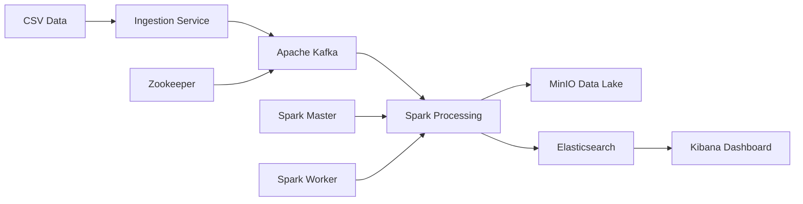

# 🚀 Batch Processing Data Pipeline

A scalable, containerized data pipeline for processing e-commerce user events and generating customer profiles for machine learning applications.

## 🏗️ Architecture Overview

This project implements a modern data engineering pipeline using a microservices architecture with the following components:



### Core Components

- **🔄 Apache Kafka**: Message streaming platform for reliable data ingestion
- **⚡ Apache Spark**: Distributed processing engine for data transformation and aggregation
- **🗄️ MinIO**: S3-compatible object storage for data lake functionality  
- **🔍 Elasticsearch**: Analytics database for storing processed customer profiles
- **📊 Kibana**: Visualization platform for exploring customer data
- **🐍 Python Services**: Custom ingestion and processing applications

## 🌍 Multi-Environment Support

This pipeline works seamlessly in both **GitHub Codespaces** and **local WSL** environments:

### GitHub Codespaces
- Automatic environment detection
- Dynamic URL generation (e.g., `https://super-duper-waffle-pvqvvr74jxg3rx-5601.app.github.dev/`)
- Port visibility configuration
- HTTPS endpoints with proper forwarding

### Local Development (WSL)
- Standard localhost URLs (e.g., `http://localhost:5601/`)
- Direct container networking
- Optimized for local development

## 🚀 Quick Start

### 1. Environment Setup
```bash
# Detect environment and generate service URLs
./setup-environment.sh

# Configure port visibility (Codespaces only)
./configure-ports.sh
```

### 2. Dataset Setup
```bash
# Download the dataset manually from Kaggle:
# 1. Visit: https://www.kaggle.com/mkechinov/ecommerce-events-history-in-electronics-store
# 2. Download the main CSV file
# 3. Save it as ./data/electronics.csv

# Verify dataset is ready
make check-data
```

### 3. Start Core Services
```bash
# GitHub Codespaces
docker-compose -f docker-compose.yml -f docker-compose.codespaces.yml up -d

# Local/WSL
docker-compose up -d

# Or use Make command
make start
```

### 4. Run the Pipeline
```bash
# Start data ingestion (CSV -> Kafka)
make ingest

# Start data processing (Kafka -> Spark -> MinIO + Elasticsearch)
make process
```

## 📂 Project Structure

```
data_pipeline_project/
├── 🐳 docker-compose.yml           # Main orchestration file
├── 🐳 docker-compose.codespaces.yml # Codespaces-specific overrides
├── ⚙️ .env                         # Environment variables
├── 📋 setup-environment.sh         # Environment detection & setup
├── 🔧 configure-ports.sh           # Codespaces port configuration
│
├── 📊 data/                        # Source data directory
│   └── electronics.csv             # Sample e-commerce data
│
├── 🔄 ingestion/                   # Data ingestion service
│   ├── Dockerfile
│   ├── requirements.txt
│   └── src/
│       └── kafka_producer.py
│
├── ⚡ processing/                   # Spark processing application
│   ├── Dockerfile
│   ├── requirements.txt
│   └── src/
│       ├── data_processor.py
│       └── customer_profiles.py
│
├── 🎯 spark/                       # Spark configuration
│   ├── apps/                       # Spark applications
│   └── jars/                       # Additional JAR dependencies
│
├── 📓 notebooks/                   # Jupyter notebooks for analysis
├── ⚙️ config/                      # Additional configurations
└── 📚 docs/                        # Project documentation
```

## 🔧 Service Configuration

### Service Ports
| Service | Local Port | Description |
|---------|------------|-------------|
| Kibana | 5601 | Analytics dashboard |
| Spark Master UI | 8080 | Cluster monitoring |
| Spark Worker UI | 8081 | Worker node status |
| MinIO Console | 9001 | Storage management |
| MinIO API | 9000 | Object storage API |
| Elasticsearch | 9200 | Search & analytics |
| Kafka | 9092 | Message streaming |
| Zookeeper | 2181 | Kafka coordination |

### Environment Variables
Key configuration options in `.env`:
- `ENVIRONMENT`: Automatically set to `codespaces` or `local`
- `KAFKA_TOPIC`: Default topic for raw events
- `MINIO_BUCKET`: Data lake bucket name
- `ELASTICSEARCH_INDEX`: Customer profiles index

## 📈 Data Flow

1. **Ingestion**: Python service reads CSV and publishes JSON messages to Kafka
2. **Streaming**: Kafka buffers and distributes events to processing services
3. **Processing**: Spark application:
   - Consumes events from Kafka
   - Cleans and validates data
   - Archives raw data to MinIO (Parquet format)
   - Aggregates customer metrics
   - Stores profiles in Elasticsearch
4. **Visualization**: Kibana provides dashboards for exploring customer profiles

## 🛠️ Development Workflow

### Phase 1: Infrastructure Setup ✅
- [x] Multi-environment docker-compose configuration
- [x] Environment detection and URL generation
- [x] Port configuration for Codespaces
- [x] Service orchestration with health checks

### Phase 2: Data Acquisition & Ingestion ⚡
- [x] Manual dataset acquisition setup
- [x] Dataset validation and preprocessing
- [ ] Python Kafka producer service
- [ ] CSV parsing and JSON transformation
- [ ] Error handling and data validation
- [ ] Configurable batch processing

### Phase 3: Data Processing
- [ ] Spark application development
- [ ] Data cleaning and validation logic
- [ ] Customer profile aggregation
- [ ] MinIO integration for data lake
- [ ] Elasticsearch indexing

### Phase 4: Visualization & Monitoring
- [ ] Kibana dashboard configuration
- [ ] Custom visualizations for customer profiles
- [ ] Service monitoring and alerting
- [ ] Performance optimization

## 🔧 Common Commands

```bash
# Start all services
docker-compose up -d

# View service logs
docker-compose logs -f [service-name]

# Run ingestion service
docker-compose --profile ingestion up ingestion-service

# Run Spark processing
docker-compose --profile processing up spark-processor

# Stop all services
docker-compose down

# Remove all data (clean restart)
docker-compose down -v

# Check service health
docker-compose ps
```

## 🐛 Troubleshooting

### Codespaces Issues
- **Services not accessible**: Run `./configure-ports.sh` to set port visibility
- **URLs not working**: Check the 'Ports' tab in VS Code and ensure ports are public
- **Slow startup**: Services may take longer in Codespaces; check logs for readiness

### Local Issues
- **Port conflicts**: Ensure no other services are using the configured ports
- **Memory issues**: Elasticsearch requires at least 2GB RAM; adjust if needed
- **Network issues**: Check Docker network configuration if services can't communicate

### General Issues
- **Service dependencies**: Wait for health checks before starting dependent services
- **Volume permissions**: Ensure Docker has permissions to create volumes
- **Resource limits**: Monitor Docker resource usage for optimal performance

## 🤝 Contributing

1. Fork the repository
2. Create a feature branch
3. Make your changes
4. Test in both Codespaces and local environments
5. Submit a pull request

## 📄 License

This project is licensed under the MIT License - see the [LICENSE](LICENSE) file for details.

---

**💡 Tip**: Always run `./setup-environment.sh` after cloning to detect your environment and get the correct service URLs!